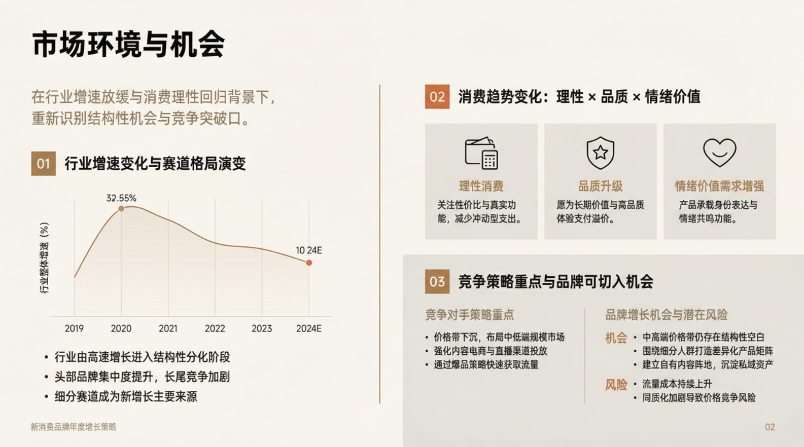
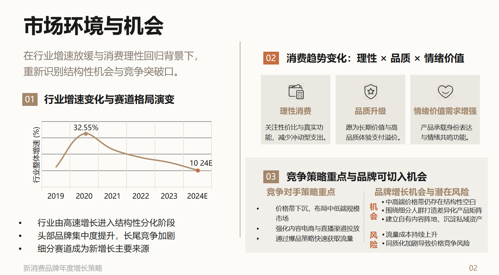
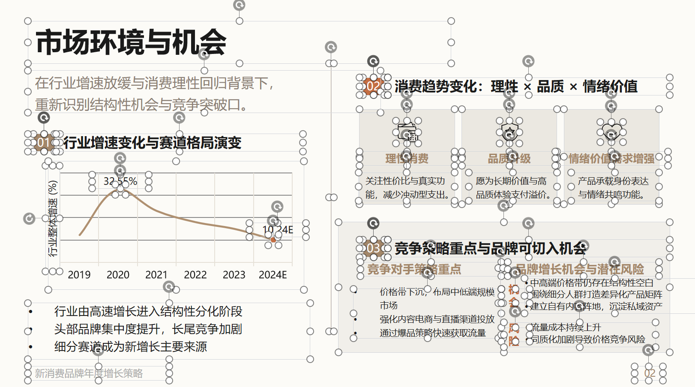
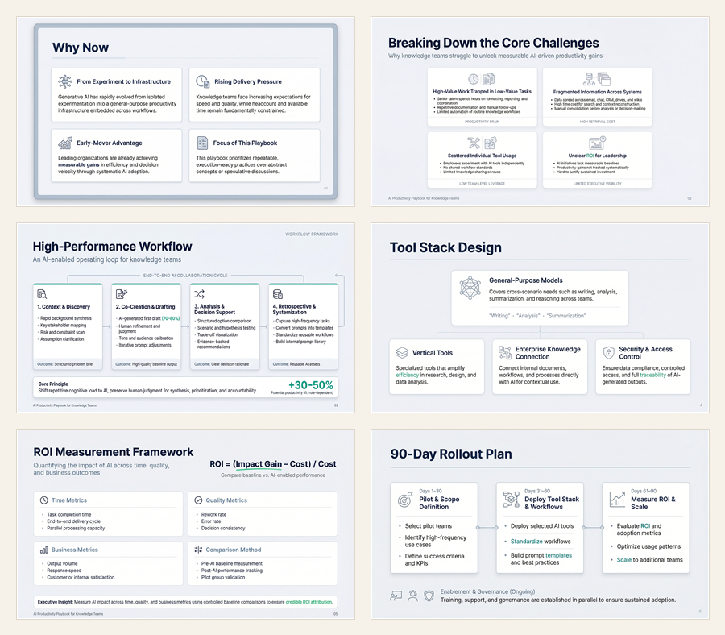
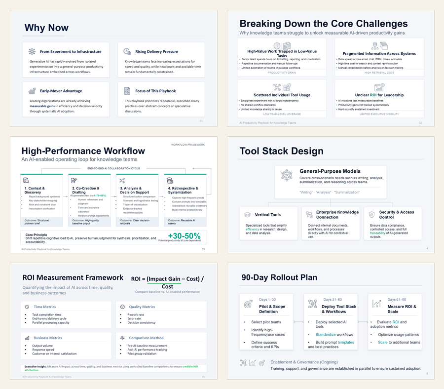

# EditDeck

<p align="center">从需求文本到 PPT 图片、普通 PPT、可编辑 PPT 的一体化生成流水线。</p>

<p align="center">
  
  
  
  
</p>

<p align="center"><strong>AI 纯图 -> EditDeck PPT -> 完全可编辑</strong></p>
<table align="center">
  <tr>
    <th width="33%">1) AI 生成纯图（origin）</th>
    <th width="33%">2) EditDeck 生成 PPT（pic）</th>
    <th width="33%">3) 我们的 PPT 可直接编辑（edit）</th>
  </tr>
  <tr>
    <td></td>
    <td></td>
    <td></td>
  </tr>
</table>

<p align="center">
  <a href="#why">Why</a> ·
  <a href="#highlights">Highlights</a> ·
  <a href="#public-site">公益站</a> ·
  <a href="#showcase">案例对照</a> ·
  <a href="#quick-start">Quick Start</a> ·
  <a href="#usage">Usage</a> ·
  <a href="#configuration">Configuration</a> ·
  <a href="#faq">FAQ</a>
</p>

---

<a id="why"></a>

## Why

做 PPT 往往不是难在某一步，而是难在流程太碎: 想清楚结构、补页面内容、生成视觉稿、导出文档、最后还要为了“可编辑”再重新搭一遍。

EditDeck 把这条原本零散、反复切换的链路，收拢成一套可以连续推进的工作流：

- 从自然语言需求出发，自动生成结构化的大纲和逐页内容
- 批量渲染每一页视觉稿，并打包成普通 `pptx`
- 可以接着基于生成结果目录，或直接基于已有页面图片，继续重建可编辑 `pptx`
- 用统一的 `YAML` 配置同时管理文本模型、图片模型、可编辑链路和 MinerU 解析能力
- 同一套能力同时提供 Web、CLI 和 HTTP API，既适合直接使用，也方便接入更大的系统

如果你想要的是“先尽快把视觉稿跑出来，再一路推进到真正可编辑、可交付的演示文档”，这套流程就是为这个目标设计的。

<a id="highlights"></a>

## Highlights

- 单配置入口：项目默认只读取 [config/app.yaml](./config/app.yaml)
- 双工作流支持：既可以从需求直接生成，也可以对已有图片二次生成可编辑 PPT
- 可编辑链路完整：图片解析、元素抽取、占位匹配、浏览器导出都已经串起来
- 跨平台更友好：浏览器路径可以留空，运行时会按传入路径、环境变量、系统 `PATH` 自动探测
- 覆盖方式直接：CLI 参数和 Web/API 请求参数都可以在运行时覆盖配置文件

<a id="public-site"></a>

## 公益站

我建了一个公益站 [editdeck.top](https://editdeck.top)，方便大家免费体验我们的开源项目。如果主域名暂时访问不了，也可以直接访问备用地址 [http://118.195.198.236/](http://118.195.198.236/)。

- 点 `Star` 后可免费使用 5 张
- 每日签到可额外获得 1 张
- 受服务器成本限制，站点偶尔可能会出现一些非预期错误
- 如果你遇到问题，欢迎随时向我们反馈

<a id="showcase"></a>

## 案例对照

参考 PPTAgent 的 case study 展示方式，这里把每个案例都拆成左右两栏：左侧是纯图结果，右侧是基于同一份内容重建出的完全可编辑版本。

### 案例 1 · AI Productivity Playbook for Knowledge Teams

**Prompt**

> Create a professional presentation in English titled "AI Productivity Playbook for Knowledge Teams". Include practical workflows, tool stacks, ROI metrics, and a 90-day rollout plan. Keep all slide text strictly in English.

<table>
  <tr>
    <th width="50%">纯图版本</th>
    <th width="50%">完全可编辑版本</th>
  </tr>
  <tr>
    <td></td>
    <td></td>
  </tr>
</table>

### 案例 2

**Prompt**

> 做一份《AI 客服知识库升级方案》PPT，面向企业数字化与客服平台主管，围绕现状痛点、升级目标、知识中台架构、问答流程优化、运营指标与实施计划展开，适合六页呈现。

**Style**

> PPT 整体呈现 16:9 宽屏深色科技风，主色以深海军蓝、冷青蓝、电光蓝为核心，辅以少量高亮青色作为数据强调色，背景以深蓝黑渐变、细密网格、弱发光线条和玻璃质感面板构成。字体采用思源黑体 / 苹方 / 微软雅黑体系，标题更厚重，正文更克制，层级鲜明。页面强调中轴对齐与模块化网格系统，常用大标题横向锚点、分栏数据卡、发光描边图表、半透明信息面板与线性科技图标。整体气质冷静、专业、偏未来感，但必须保持高可读性，避免赛博朋克式杂乱，避免大面积紫色，强调企业级 AI 产品汇报的理性秩序。

<table>
  <tr>
    <th width="50%">纯图版本</th>
    <th width="50%">完全可编辑版本</th>
  </tr>
  <tr>
    <td></td>
    <td></td>
  </tr>
</table>

### 案例 3

**Prompt**

> 做一份《企业 Copilot 落地的双引擎实施路线图》PPT，面向集团管理层汇报，围绕数据治理引擎与业务应用引擎两条主线，讲清建设背景、核心痛点、总体架构、分阶段路线图、试点场景、投入产出与风险控制，适合六页呈现。

**Style**

> PPT 整体呈现16:9 宽屏学术商务风，以微软红蓝为主色调，搭配浅灰与蓝灰底色，采用思源黑体 / 苹方 / 微软雅黑体系，层级清晰、信息密度适中。页面采用顶部标题栏 + 左侧纵向时间轴 + 右侧斜向分区双引擎的差异化构图，所有卡片统一 18–22px 圆角与轻量阴影，模块标题使用胶囊色块，重要容器配以红蓝虚线外框，搭配统一线宽线性图标强化视觉规范。

<table>
  <tr>
    <th width="50%">纯图版本</th>
    <th width="50%">完全可编辑版本</th>
  </tr>
  <tr>
    <td></td>
    <td></td>
  </tr>
</table>

<a id="quick-start"></a>

## Quick Start

### 1. 安装依赖

```bash
pip install -r requirements.txt
```

### 2. 修改配置

编辑 [config/app.yaml](./config/app.yaml)。

- 项目模板中的 `api_key` 默认留空
- `base_url` 可以继续使用当前文件里的地址
- 更完整的字段说明见 [config/README.md](./config/README.md)

### 3. 选择运行方式

启动 Web 服务：

```bash
uvicorn webapp.main:app --host 0.0.0.0 --port 8000 --reload
```

浏览器访问：

```text
http://127.0.0.1:8000/
```

或者直接使用 CLI：

```bash
python -m app.cli generate "做一份 AI 办公效率提升方案"
```

<a id="usage"></a>

## Usage

### Web

Web 入口由 [webapp/main.py](./webapp/main.py) 提供，适合直接在页面里填写需求、风格和运行参数。

- 风格输入支持两种方式：`风格描述`（文本）或 `风格参考图`（图片），二者二选一
- 支持上传参考资料文件（`source_files`，可多选）：`.txt` / `.md` / `.pdf` / `.docx`
- 图片复刻模式支持上传待复刻页面（`replica_images`，可多选）：`.png` / `.jpg` / `.jpeg` / `.webp`

### CLI

只生成图片和普通 PPT：

```bash
python -m app.cli generate "做一份 AI 办公效率提升方案" \
  --slide-count auto \
  --export-mode both
```

补充参考文件（支持pdf，docx，txt，md等）和需求，生成PPT：

```bash
python -m app.cli generate "基于我的文档中的国内外研究现状，做一份现状分析ppt" \
  --slide-count auto \
  --export-mode both \
  --source-file data.docx 
```

带风格和参考文件一起生成：

```bash
python -m app.cli generate "做一份 AI 客服知识库升级方案" \
  --style-description "16:9 深色科技风，蓝青主色，高对比可读性" \
  --source-file ./docs/brief.md \
  --source-file ./docs/customer_faq.pdf \
  --export-mode both
```

生成普通 PPT 后继续输出可编辑 PPT：

```bash
python -m app.cli generate "做一份 AI 办公效率提升方案" \
  --editable-ppt \
  -edit
```

基于已有运行目录继续生成可编辑 PPT：

```bash
python -m app.cli editable \
  --run-dir ./generated/<run_id> \
  --output-dir ./generated/<run_id>/editable_deck \
  -edit
```

基于现有图片直接生成可编辑 PPT：

```bash
python -m app.cli editable \
  --image ./generated/run_xxx/slide_01.png \
  --image ./generated/run_xxx/slide_02.png \
  --output-dir ./generated/run_xxx/editable_deck \
  -edit
```

常用参数：

- `--config-file`：指定配置文件，默认读取 `config/app.yaml`
- `--style-description`：用文字指定风格
- `--style-template`：用图片指定风格
- `--source-file`：上传参考资料文件（可重复传入多个）
- `--editable-ppt`：在生成图片后继续生成可编辑 PPT
- `-edit` / `--edit`：启用当前可用的可编辑资产匹配后端
- `--mineru-api-key`：按需覆盖 `mineru.api_key`
- `--force-reextract-assets`：强制重新抽取元素
- `--disable-asset-reuse`：禁止一个素材复用到多个 `PH`

说明：

- `--style-description` 和 `--style-template` 互斥
- CLI 传参优先级高于 `YAML` 配置

## HTTP API

主要接口：

- `GET /api/health`：健康检查
- `POST /api/generate`：同步生成
- `POST /api/generate/start`：异步生成
- `POST /api/editable/start`：基于已有 `run_id` 启动可编辑 PPT 任务
- `GET /api/generate/status/{job_id}`：查询异步任务状态

如果希望在生成阶段直接产出可编辑 PPT，请在请求里额外传入：

- `generate_editable_ppt=true`
- `asset_backend=edit`

当 `config/app.yaml` 里没有可用的 `mineru.api_key` 时，需要通过请求显式传入 `mineru_api_key`。

<a id="configuration"></a>

## Configuration

项目只保留一个主配置文件：

```text
config/app.yaml
```

配置块说明：

- `app`：输出目录和默认页数
- `models.text`：大纲、文案等文本生成模型
- `models.editable`：可编辑 PPT 生成链路
- `models.image`：图片生成模型
- `mineru`：页面元素解析与资产抽取

几个实用规则：

- `models.image.api_key` 为空时，会回退使用 `models.text.api_key`
- `models.editable.base_url` 为空时，会回退使用 `models.text.base_url`
- `models.editable.api_key` 为空时，会回退使用 `models.text.api_key`
- `mineru.api_key` 为空时，会继续回退尝试 `models.editable.api_key` 和 `models.text.api_key`
- `models.editable.browser_path` 可以留空，运行时会自动尝试显式传参、环境变量和系统 `PATH`

完整示例和字段参考见 [config/README.md](./config/README.md)。

<a id="faq"></a>

## FAQ

### 可编辑 PPT 提示缺少 key

优先检查：

- [config/app.yaml](./config/app.yaml) 里的 `mineru.api_key`
- CLI 参数里的 `--mineru-api-key`
- Web / API 请求里的 `mineru_api_key`

### 浏览器执行失败或下载失败

可以按这个顺序排查：

- 先让 `models.editable.browser_path` 保持空值
- 如果需要显式指定浏览器，再传 `--editable-browser-path`
- 或者配置 `EDITABLE_PPT_BROWSER_PATH`、`CHROME_PATH`、`GOOGLE_CHROME_BIN`、`CHROMIUM_PATH`、`BROWSER_PATH`
- 如果系统里没有可用浏览器，执行 `playwright install chromium`

### 占位替换效果不理想

可以尝试：

- 提高 `mineru.max_refine_depth`
- 开启 `--force-reextract-assets`
- 开启 `--disable-asset-reuse`

### 只想复用已有素材

可以使用 `--assets-json`，但当前更适合单图片模式下直接指定已有 `assets.json`。

## 希望与大家交流

欢迎对可编辑 PPT 生成、文档智能解析与实际部署流程感兴趣的研究者、开发者和同学与我们交流。

如果你希望进一步交流技术思路、效果评测、实现细节，或分享相关研究与工程实践经验，欢迎添加微信联系。我们也很期待与更多同行围绕真实问题展开学习讨论、相互启发。

<p align="center">
  
</p>
